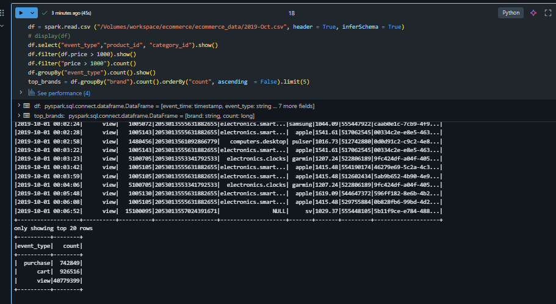

Day 2 – Apache Spark Fundamentals

What I Learned

1. Spark Architecture

* Driver: Controls the execution, plans the job, and coordinates tasks.

* Executors: Run the actual tasks and process data.

* DAG (Directed Acyclic Graph): Represents the execution plan Spark creates for transformations and actions.

This helped me understand what happens behind the scenes when Spark runs a job.

---

2️. DataFrames vs RDDs

* RDDs are low-level and give more control, but require more code.

* DataFrames are higher-level, easier to use, and optimized internally.

* Most real-world Spark workloads prefer DataFrames because they are faster and more readable.

---

3️. Lazy Evaluation

* Spark does not execute transformations immediately.

8 Operations like select or filter are only executed when an action (such as show, count, or write) is triggered.

* This allows Spark to optimize the execution plan before running the job.

---

4️. Notebook Magic Commands

Learned how different magic commands work inside Databricks notebooks:
(prefixed with % for line magics or %% for cell magics)

%python → Run Python code
%sql → Run SQL queries on data
%fs → Interact with the Databricks file system
%md: Renders the cell content as Markdown documentation. 
%run: Executes another notebook and brings all of its defined functions and variables into the current notebook's scope
%pip: Installs Python packages within the notebook's environment.
%sh: Runs shell (Bash) commands on the cluster's driver node.
%fs: Executes dbutils.fs
%skip: Skips the execution of the current cell when the notebook is run.
%%writefile: Writes the content of a cell to a file in the workspace.
%cat: Reads and displays the content of a file in the workspace.
%%time: Times the execution of the entire cell once.
%history: Shows the command history for the current session
%env: Views or sets environment variables.
For a complete list of available magics in your environment, you can run the %lsmagic

---

Tasks Completed

Uploaded a sample e-commerce CSV file
Read the file into a Spark DataFrame
Performed basic operations:
select, filter, groupBy, orderBy
Exported the transformed results for reuse
---

 Hands-on Summary

Using Spark DataFrames, I was able to:
Load structured data from CSV
Apply filters to narrow down results
Group data to derive insights
Sort results for better analysis
This made Spark feel much more practical compared to just learning concepts.
---
 Reflections

Spark feels powerful once the execution model is clear.
Lazy evaluation explains why Spark code behaves differently from Pandas.
DataFrames provide a good balance between performance and simplicity.
---

#DatabricksWithIDC
